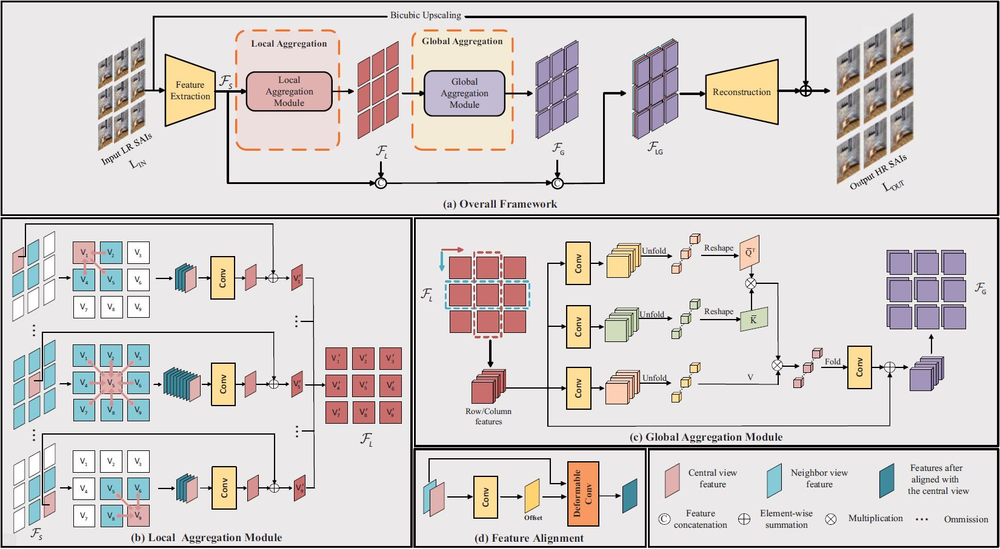
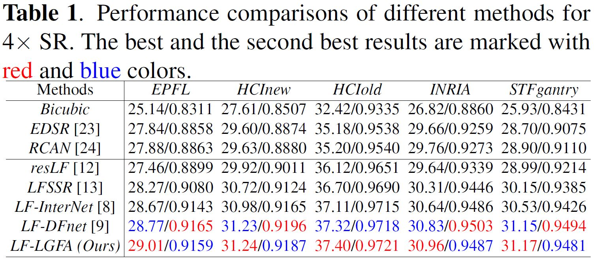
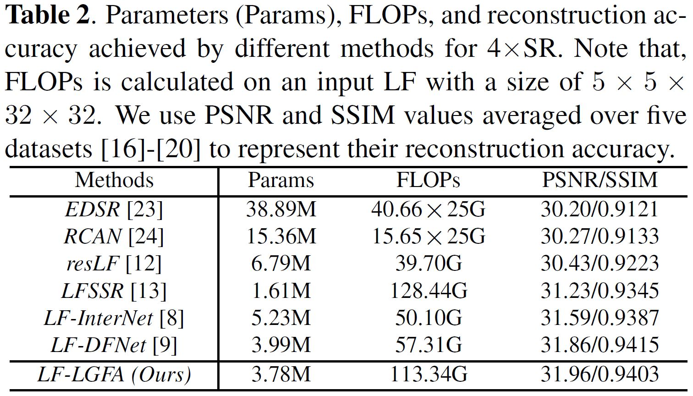
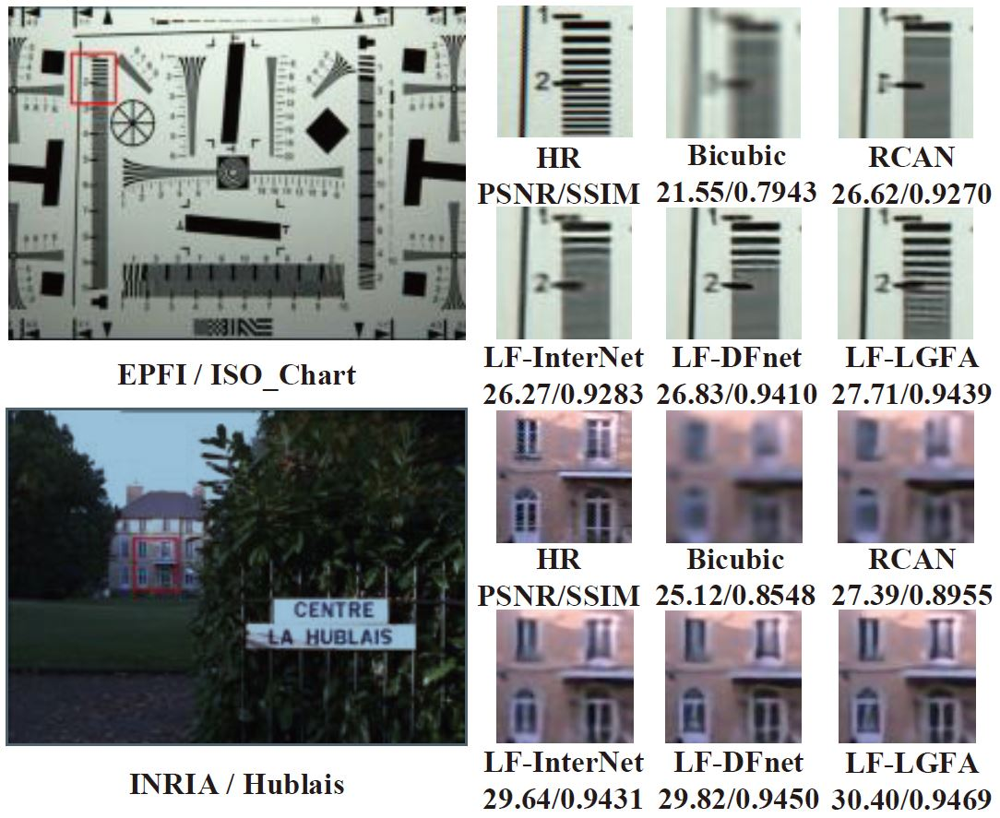

# LF-LGFA

This is the Pytorch implementation of "Local-Global Feature Aggregation For Light Field Image Super-Resolution". 

## Overview

## Requirements:

- Pytorch = 1.7.1
- torchvision = 0.8.2
- CUDA = 11.0
- python = 3.7
- Matlab (For visual results generation)

## Compile DCN

The DCN part of our code is referred to [LF-DFnet](https://github.com/ZhengyuLiang24/LF-DFnet). 

- Cd to `code/dcn`.
- For Windows users, run `cmd make.bat`. For Linux users, run bash `bash make.sh`. The scripts will build DCN automatically and create some folders. 

## Datasets

- Experiments are performed on the EPFL, HCInew, HCIold, INRIA and STFgantry datasets. You can download our processed datasets via [Baidu Drive](https://pan.baidu.com/s/1okWHXUEbrAt7F3-689P_XA) (key:1234), and place them in the folder `./data/`. 

## Train

- Run `train.py` to perform network training. Checkpoints will be saved in`./log/`.

## Test

- Run `test.py` to perform network inference. 
- Run `GenerateResultImages.m` to convert '.mat' files in `./Results/` to '.png' images to `./SRimages/`.

## Results

### Quantitative Results

### Computation Efficiency

### Visual Comparisons

## Acknowledgement

This code is built on [LF-DFnet](https://github.com/ZhengyuLiang24/LF-DFnet). We thank the authors for sharing their codes.

## Contact

You can concat with me via wangyan@bit.edu.cn

